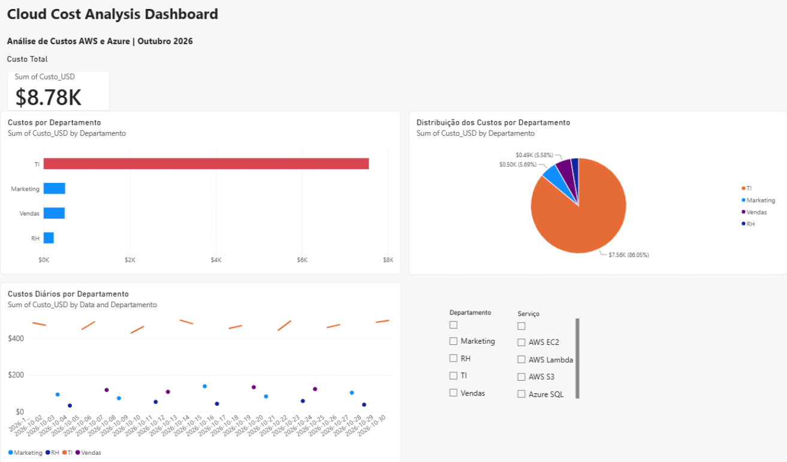

# Cloud Cost Analysis Dashboard

## 📸 Dashboard

## 📊 Sobre o Projeto

Projeto desenvolvido em Power BI para análise de custos em nuvem utilizando dados fictícios de serviços AWS e Azure.

O objetivo deste projeto foi praticar conceitos de análise de dados, visualização de informações e construção de dashboards interativos.

## 🚀 Funcionalidades

- Visualização do custo total dos serviços
- Análise de custos por departamento
- Distribuição dos custos por departamento
- Evolução diária dos custos
- Filtro por departamento
- Filtro por serviço

## 🛠️ Tecnologias Utilizadas

- Power BI
- Cloud Computing
- AWS
- Azure
- CSV

## 📈 Dashboard

O dashboard apresenta:

- KPI de custo total
- Custos por departamento
- Distribuição percentual dos gastos
- Evolução dos custos ao longo do tempo
- Filtros dinâmicos para análise

## 🎯 Objetivo

Praticar habilidades relacionadas a:

- Power BI
- Data Analytics
- Visualização de Dados
- Cloud Computing
- Análise de Custos

## 📂 Arquivos do Projeto
 
- `CloudCostAnalysisDashboard.pbix` → Arquivo do Power BI
- `cloud_costs.csv` → Base de dados utilizada para análise
- `dashboard.png` → Imagem do dashboard

## 👨‍💻 Autor

Vitor Fernandes

LinkedIn: https://www.linkedin.com/in/vitorsfv 
